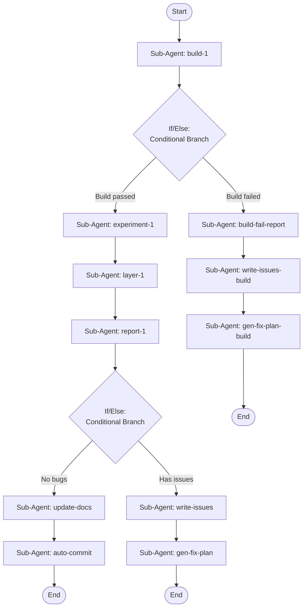

## Workflow Execution Guide

Follow the Mermaid flowchart above to execute the workflow. Each node type has specific execution methods as described below.

### Execution Methods by Node Type

- **Rectangle nodes (Sub-Agent: ...)**: Execute Sub-Agents
- **Diamond nodes (AskUserQuestion:...)**: Use the AskUserQuestion tool to prompt the user and branch based on their response
- **Diamond nodes (Branch/Switch:...)**: Automatically branch based on the results of previous processing (see details section)
- **Rectangle nodes (Prompt nodes)**: Execute the prompts described in the details section below

## Sub-Agent Node Details

#### build-1(Sub-Agent: build-1)

**Description**: Build the project with cabal

**Model**: sonnet

**Tools**: Bash, Read

**Prompt**:

```
Run `cabal build all` in the NeSyCat-HaskTorch project directory. Report whether the build succeeds or fails. If it fails, capture the full error output including which module failed and the exact compiler error. Output a clear verdict: BUILD_PASS or BUILD_FAIL followed by details.
```

#### experiment-1(Sub-Agent: experiment-1)

**Description**: Run experiments and capture scores/times

**Model**: sonnet

**Tools**: Bash, Read

**Prompt**:

```
Run the NeSyCat-HaskTorch experiments and capture performance metrics.

1. Run `cabal run binary-benchmark -- +RTS -s` and capture accuracy, F1, scores, wall clock time, peak memory.

2. Run `cabal run binary-test-real -- +RTS -s` and capture final loss, wall clock time, peak memory.

3. Run `cabal run binary-test-real-beta -- +RTS -s` and capture final loss, learned beta, wall clock time, peak memory.

For each experiment, report: experiment name, key scores, wall clock time, peak memory. Format as a table. Flag any NaN/Infinity as a BUG. Output EXPERIMENTS_PASS if all ran without crashing, EXPERIMENTS_FAIL if any crashed.
```

#### layer-1(Sub-Agent: layer-1)

**Description**: Verify ABCDEFG layer consistency

**Model**: opus

**Tools**: Bash, Read, Glob, Grep

**Prompt**:

```
Verify the ABCDEFG pipeline consistency of the NeSyCat-HaskTorch project. The project has layers A_Categorical, B_Logical, C_Domain, D_Grammatical, and within each layer modules follow the A→B→C→D→E→F→G sub-pipeline.

Check the following:

1. **Theory → Extension coverage**: For every type class declared in D_Theory modules, verify there is a corresponding E_Extension module with type family instances. List any theories without extensions.

2. **Vocabulary → Realization coverage**: For every vocabulary type defined in B_Vocabulary modules, verify there is a realization (interpretation) that connects it. List any vocabularies without realizations.

3. **Extension → Interpretation coverage**: For every E_Extension, verify there is a matching F_Interpretation module that provides concrete implementations. List any extensions without interpretations.

4. **Category connection**: Verify that A_Category modules (DATA, TENS GADTs) are referenced by the interpretations — i.e., the interpretations actually use the categorical witnesses.

5. **Domain completeness**: For each domain in C_Domain, check which sub-pipeline steps (A through G) exist. Do NOT hardcode domain names — discover them dynamically by scanning the actual directory structure.

Scan the actual source files using Glob and Grep. Report a structured summary:
- For each layer: which sub-steps exist, which are missing
- Any orphaned modules (exist but not connected)
- Overall verdict: LAYERS_CONSISTENT or LAYERS_INCONSISTENT with specific gaps listed.
```

#### report-1(Sub-Agent: report-1)

**Description**: Consolidate verification results into report

**Model**: sonnet

**Tools**: Bash, Read

**Prompt**:

```
Consolidate all verification results from the previous steps into a clear summary report.

Structure the report as:

## NeSyCat-HaskTorch Verification Report

### 1. Build Status
- PASS/FAIL + details

### 2. Experiment Results
- Table of experiment scores and times
- **ALWAYS report every issue, even known ones.** NaN losses, divergences, numerical instabilities, missing eval blocks — list them ALL every time. A known bug is still a bug.
- Flag any regressions compared to expected behavior

### 3. Layer Consistency
- ABCDEFG coverage per layer
- Missing connections or gaps
- **ALWAYS list orphaned modules** (modules that exist but are never imported)
- **ALWAYS list placeholder-only modules** (modules with no real code)

### 4. Issue Registry
List EVERY issue found, categorized as:
- **BLOCKING**: Build failures, crashes, missing modules that break the pipeline
- **BUG**: NaN losses, numerical instabilities, divergences, incorrect results
- **DEBT**: Orphaned modules, unused code, placeholder files, stale references
- **INFO**: Observations that aren't issues but worth noting

### Overall Verdict
- **ALL_CLEAR**: ONLY if there are zero BLOCKING and zero BUG issues
- **ISSUES_FOUND**: If ANY blocking or bug issues exist, even "known" ones

A "known" bug is NOT the same as "acceptable". If any experiment produces NaN, the verdict is ISSUES_FOUND. If orphaned modules exist, list them as DEBT. Never suppress or downplay findings — the whole point of this report is to surface problems, not hide them.
```

#### update-docs(Sub-Agent: update-docs)

**Description**: Update .claude/ docs to match current project state

**Model**: opus

**Tools**: Bash, Read, Write, Edit, Glob, Grep

**Prompt**:

```
Update the .claude/ documentation to accurately reflect the current state of the NeSyCat-HaskTorch project. You have the verification report from the previous steps as context.

Do the following:

1. **Read** the current `.claude/CLAUDE.md`
2. **Scan** the actual project structure (directories, .cabal file, source files) to determine:
   - Which executables actually exist and are runnable
   - Which layers and domains currently exist
   - Which logical interpretations are present
   - The actual sub-pipeline naming convention (A_Category, B_Theory, BA_Interpretation, BC_Extension, C_TypeSystem, D_Vocabulary, DA_Realization) — NOT the idealized A-G names
3. **Update CLAUDE.md** to match reality:
   - Fix the Build & Run Commands section (only list executables that exist in the .cabal file)
   - Fix the Architecture section (only list layers/domains that actually exist)
   - Fix any references to removed modules or outdated structure
   - Keep the document concise and accurate
4. **Check each agent file** in `.claude/agents/` — update any that reference domains, modules, or structures that no longer exist
5. **Delete `.claude/ISSUES.md`** if it exists — since there are no issues, the file should not be present.
6. **Delete `.claude/FIX_PLAN.md`** if it exists — since there are no issues, no fix plan is needed.

IMPORTANT: Only update what is factually wrong. Do not rewrite working descriptions, add unnecessary detail, or change the document's style. Preserve the author's voice and structure.
```

#### auto-commit(Sub-Agent: auto-commit)

**Description**: Auto-commit verified changes to git

**Model**: sonnet

**Tools**: Bash, Read

**Prompt**:

```
All verification checks passed and .claude/ docs have been updated. Commit the current state to git.

1. Run `git status` to see all changes (staged, unstaged, untracked)
2. Add specific changed files with `git add`:
   - Any modified `.claude/*.md` files (CLAUDE.md, agents, etc.)
   - Any modified source files (`.hs`, `.cabal`)
   - Any deleted files
   - Do NOT add `.claude/settings.local.json`, `.env`, or other local-only files
3. Run `git diff --staged` to review what will be committed
4. Create a commit with message format:
   ```
   verify: all checks passed
   
   Build: PASS
   Experiments: PASS (list executables and final losses)
   Layers: CONSISTENT
   
   Changes included in this commit:
   - (list the actual file changes being committed)
   ```
5. Do NOT push to remote
6. Print the commit hash and summary

IMPORTANT: If `git status` shows no changes to commit, just print 'Nothing to commit — working tree clean' and exit without error.
```

#### write-issues(Sub-Agent: write-issues)

**Description**: Write current issues to .claude/ISSUES.md

**Model**: sonnet

**Tools**: Write, Read

**Prompt**:

```
Write the issue registry from the verification report to `.claude/ISSUES.md`.

The file should contain the FULL verification report's Issue Registry, structured as:

```markdown
# Current Issues

_Last verified: {today's date}_

## BLOCKING
{list all blocking issues, or "None"}

## BUG
{list all bug issues with details}

## DEBT
{list all debt issues}

## INFO
{list all info items}
```

Rules:
- **Overwrite** the file completely each time — this is a snapshot, not a log
- Include enough detail for each issue that someone reading it later understands what's wrong and where
- Include the experiment scores/times table so regressions can be spotted across runs
- The file path is `/Users/cherryfunk/Repos/NeSyCat-HaskTorch/.claude/ISSUES.md`
```

#### gen-fix-plan(Sub-Agent: gen-fix-plan)

**Description**: Generate fix plan from ISSUES.md

**Model**: opus

**Tools**: Read, Write, Glob, Grep

**Prompt**:

```
Read `/Users/cherryfunk/Repos/NeSyCat-HaskTorch/.claude/ISSUES.md` and generate a concrete fix plan for every issue listed.

For each issue, analyze the relevant source code and produce:

### For BLOCKING issues:
- Exact error and root cause
- File(s) to modify with line numbers
- Proposed code change (show old → new)
- Priority: CRITICAL

### For BUG issues:
- Root cause analysis (read the relevant source files)
- File(s) to modify with line numbers
- Proposed fix (show old → new code)
- Impact assessment: what else might be affected
- Priority: HIGH

### For DEBT issues:
- For each orphaned/unused module, decide:
  - **DELETE** if truly dead code with no future purpose
  - **KEEP** if it's aspirational scaffolding for future domains/features (explain why)
  - **REFACTOR** if the code is valuable but needs to be connected
- For each decision, list the exact files and .cabal entries to change
- Priority: LOW

Write the plan to `/Users/cherryfunk/Repos/NeSyCat-HaskTorch/.claude/FIX_PLAN.md` with this structure:

```markdown
# Fix Plan

_Generated: {today's date}_
_Based on: .claude/ISSUES.md_

## Priority 1: BLOCKING
{fixes for blocking issues}

## Priority 2: BUG
{fixes for bug issues}

## Priority 3: DEBT
{fixes for debt issues, with DELETE/KEEP/REFACTOR decisions}

## Estimated Changes
- Files to modify: {count}
- Files to delete: {count}
- .cabal entries to update: {count}
```

Overwrite the file completely each time.
```

#### write-issues-build(Sub-Agent: write-issues-build)

**Description**: Write build failure to .claude/ISSUES.md

**Model**: sonnet

**Tools**: Write, Read

**Prompt**:

```
Write the build failure details to `.claude/ISSUES.md`.

The file should contain:

```markdown
# Current Issues

_Last verified: {today's date}_

## BLOCKING
- **Build failure**: {include the full error details from the build failure analysis — module, error type, root cause, suggested fix}

## BUG
None (build failed, experiments not run)

## DEBT
None (build failed, layer check not run)

## INFO
- Build must be fixed before any other verification can proceed
```

Rules:
- **Overwrite** the file completely each time
- The file path is `/Users/cherryfunk/Repos/NeSyCat-HaskTorch/.claude/ISSUES.md`
```

#### gen-fix-plan-build(Sub-Agent: gen-fix-plan-build)

**Description**: Generate fix plan for build failure

**Model**: opus

**Tools**: Read, Write, Glob, Grep

**Prompt**:

```
Read `/Users/cherryfunk/Repos/NeSyCat-HaskTorch/.claude/ISSUES.md` and generate a concrete fix plan for the build failure.

Analyze the build error:
1. Read the failing source file(s)
2. Identify the exact root cause
3. Propose the minimal fix (show old → new code)
4. Check if the fix might affect other modules

Write the plan to `/Users/cherryfunk/Repos/NeSyCat-HaskTorch/.claude/FIX_PLAN.md` with this structure:

```markdown
# Fix Plan

_Generated: {today's date}_
_Based on: .claude/ISSUES.md_

## Priority 1: BLOCKING — Build Failure

### Root Cause
{analysis}

### Fix
**File**: {path}
**Change**:
```haskell
-- OLD:
{old code}
-- NEW:
{new code}
```

### Verification
`cabal build all` should succeed after this change.
```

Overwrite the file completely each time.
```

#### build-fail-report(Sub-Agent: build-fail-report)

**Description**: Analyze build failure and suggest fixes

**Model**: sonnet

**Tools**: Bash, Read, Glob, Grep

**Prompt**:

```
The cabal build failed. Analyze the build error from the previous step.

1. Identify the exact module and line causing the failure
2. Read the failing source file to understand the context
3. Diagnose the root cause (type error, missing import, missing instance, etc.)
4. Suggest a concrete fix

Output a clear report with: failing module, error type, root cause, and suggested fix.
```

### If/Else Node Details

#### if-build(Binary Branch (True/False))

**Evaluation Target**: Check if the build succeeded (BUILD_PASS) or failed (BUILD_FAIL)

**Branch conditions:**
- **Build passed**: Build output contains BUILD_PASS or completed successfully
- **Build failed**: Build output contains BUILD_FAIL or error

**Execution method**: Evaluate the results of the previous processing and automatically select the appropriate branch based on the conditions above.

#### if-report(Binary Branch (True/False))

**Evaluation Target**: Check the Issue Registry in the report. Look at BLOCKING and BUG categories specifically.

**Branch conditions:**
- **No bugs**: The report verdict is ALL_CLEAR AND there are zero BLOCKING issues AND zero BUG issues in the Issue Registry.
- **Has issues**: The report verdict is ISSUES_FOUND OR there are any BLOCKING or BUG issues listed.

**Execution method**: Evaluate the results of the previous processing and automatically select the appropriate branch based on the conditions above.
